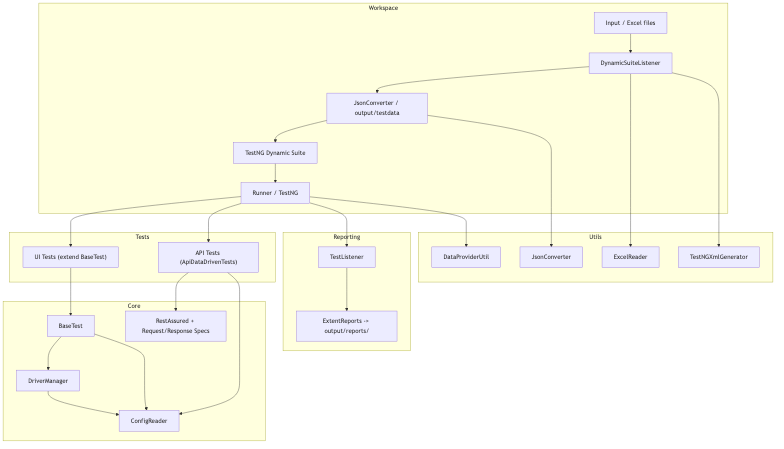

# HYBRID-SELENIUM-FRAMEWORK

A hybrid, data-driven test automation framework supporting both UI (Selenium) and API (RestAssured) testing with Excel-driven configuration and ExtentReports integration.

## Quick Start

```bash
# Run all tests
mvn test

# Run only API tests
mvn -Dtest=ApiDataDrivenTests test

# Run only Login UI tests
mvn -Dtest=LoginTests test
```

## Framework Architecture



## Project Structure

```
Input/
  └── MasterConfig.xlsx          # Excel-driven test configuration

src/
  ├── main/java/com/framework/
  │   ├── config/                # ConfigReader
  │   ├── drivers/               # DriverManager (WebDriverManager integration)
  │   ├── listeners/             # DynamicSuiteListener, TestListener
  │   ├── pages/                 # Page Object Models
  │   ├── utils/                 # ExcelReader, JsonConverter, etc.
  │   └── base/                  # BaseTest
  └── test/java/com/framework/
      └── tests/                 # UI & API test classes

output/
  ├── reports/                   # ExtentReports HTML + diagrams
  ├── testdata/                  # Generated JSON test data
  └── logs/
```

## Execution Flow

1. **DynamicSuiteListener** reads `Input/MasterConfig.xlsx` and generates JSON test data
2. **TestNG** executes via dynamic suite; each test receives data from `DataProviderUtil`
3. **UI Tests**: Initialize WebDriver via `DriverManager` (thread-safe, WebDriverManager-managed)
4. **API Tests**: Use RestAssured with baseURI from test data or config
5. **TestListener**: Integrates ExtentReports, logs results, captures screenshots, generates HTML reports

## Documentation

For a complete overview, interview script, and troubleshooting guide, see [README_FRAMEWORK.md](README_FRAMEWORK.md).

## Key Features

- ✅ Excel-driven test data configuration
- ✅ Hybrid UI + API testing in one framework
- ✅ Thread-safe WebDriver management with auto version resolution
- ✅ Data-driven test design (generic test code, external data)
- ✅ Rich HTML reporting with ExtentReports
- ✅ Dynamic TestNG suite generation
- ✅ Headless & headed execution modes via config

## Files

- `.gitignore` – Git ignore rules
- `pom.xml` – Maven configuration (JDK 21, Selenium 4.1.2, RestAssured, TestNG)
- `run_tests.ps1` – PowerShell test runner script
- `README.md` – This file
- `README_FRAMEWORK.md` – Detailed documentation

